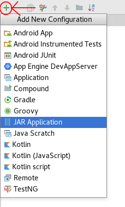
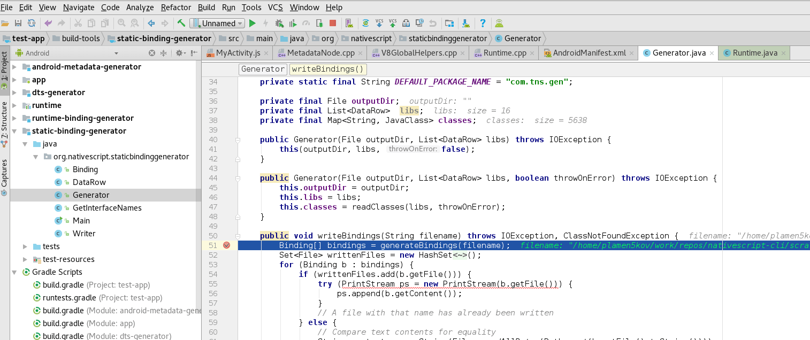
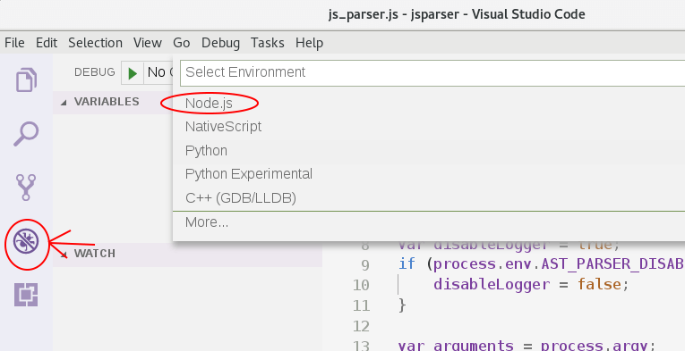

# Overview

The  shows how to debug the runtime and the application, but what if the problem is at build time?

# Debugging the metadata generator

* Open the android-runtime `test-app` in Android Studio. `/your/path/android-runtime/test-app`

Open Edit Configurations
* 

Add jar configuration to your Android Studio Project
* 

Set path to the `static-binding-generator.jar` inside your project `<app_name>/platforms/android/build-tools/static-binding-generator.jar`
And set the `Working directory` to:
`<app_name>/platforms/android/build-tools`
* 

Run debug
* 

# Debugging the js_parser

Open `<app_name>/platforms/android/build-tools/jsparser` folder in Visual Studio Code.

Add Node configuration
* 

Run debug
* 

# Debugging the static binding generator

You can follow the identical steps described for debugging the metadata generator!