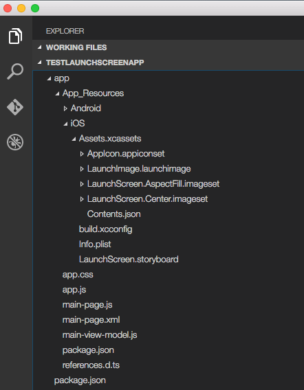
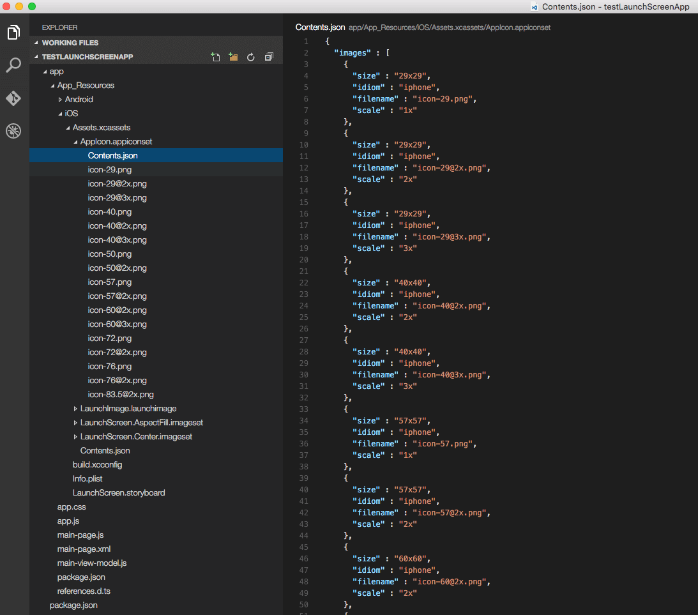
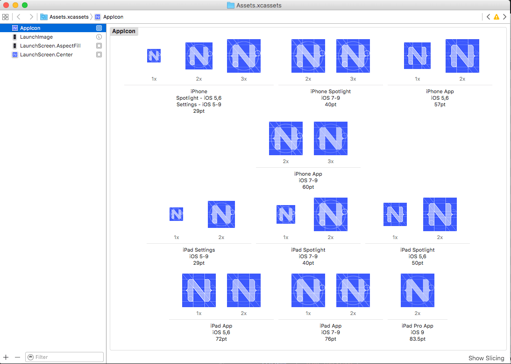
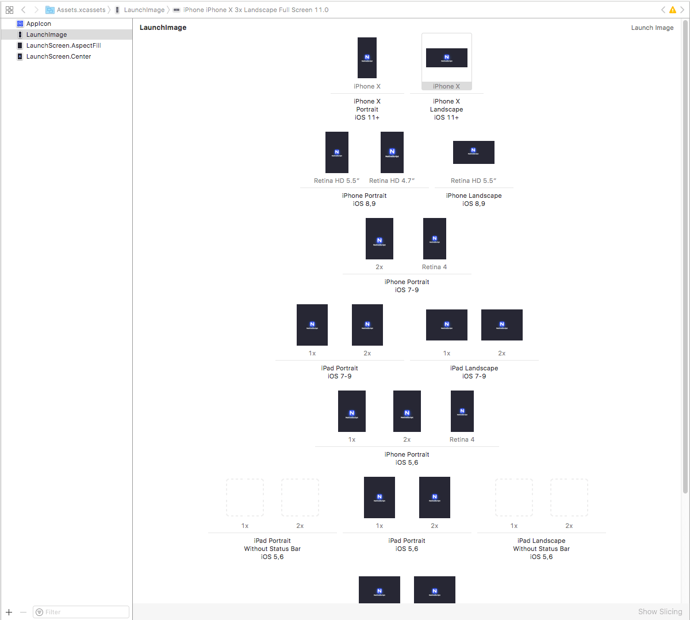
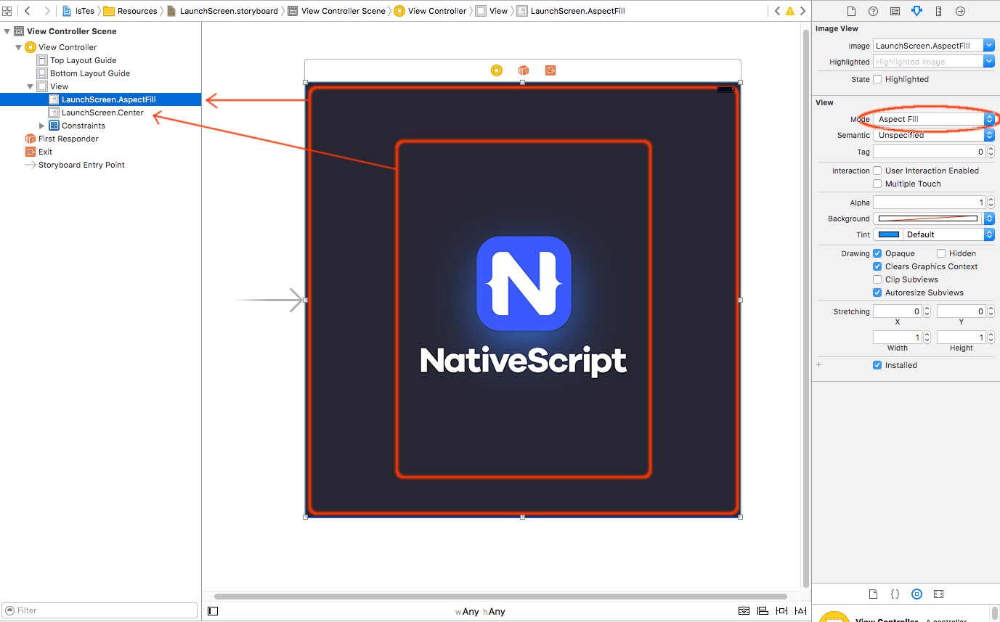
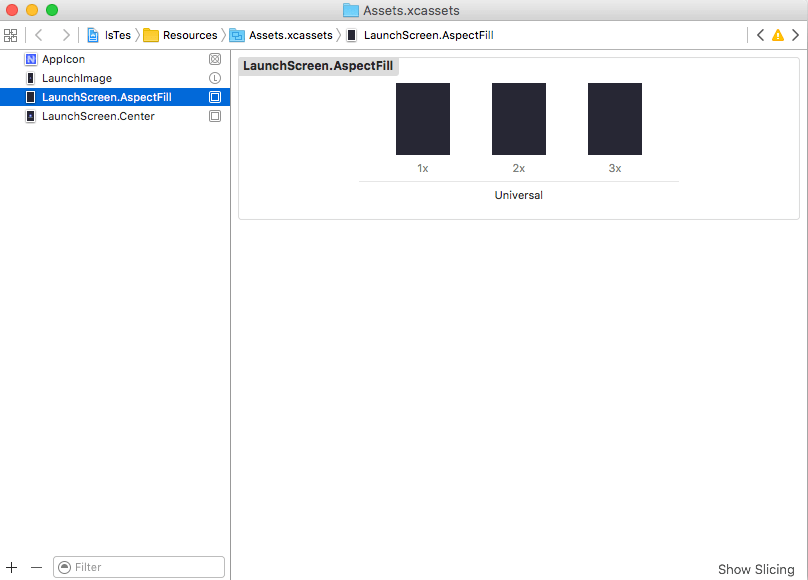
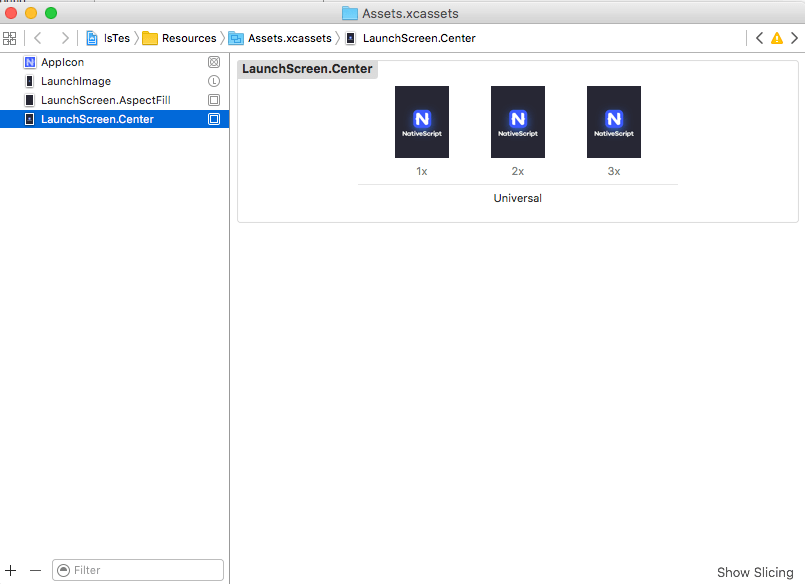

# Creating App Icons and Launch Screens for iOS 

Publishing your iOS app is an essential step in the development process and in order for your iOS application 
to be published successfully in the App Store, there are some requirements that need to be fulfilled. 
As described in [iOS Human Interface Guidelines](https://developer.apple.com/library/ios/documentation/UserExperience/Conceptual/MobileHIG/IconMatrix.html) setting the following is mandatory:

* App name
* App icon
* Launch image or files

In NativeScript, your application comes with predefined template settings and images for these steps.
In this article, we are going to introduce the workflow to create your own launch screens.

> **WARNING**: Occasionally, the iOS operating system caches your application’s icons and launch screens. If you’re updating icons or launch screens and not seeing your changes, delete the application from your device or emulator and redeploy. If on a real device: remove `platforms` folder from your project, delete app, restart device, redeploy.

## Setting launch screen and App Icons

Setting up launch screens depends on the version of iOS you are targeting.
In iOS 7 and lower, the approach for creating the launch screen is to use static image resources.
The drawback of this method is that the app developer will have to provide many different
images, each with different resolution for each iOS device. In iOS 8 and above, the approach is to create
a LaunchScreen.storyboard, which is much more powerful in terms of customization and is easier to maintain.

The default Hello-World project in NativeScript is provided with default settings that supports both 
approaches. When you build your app for devices with iOS lower then version 8, NativeScript will use the static images and when you use NativeScript to build your app for devices with iOS 8 and above, it will use the provided LaunchScreen.storyboard.

### How to set your launch screen

The default template in NativeScript (created with `tns create myApp`) provides you with predefined 
AppIcons, launch images and a LaunchScreen.storyboard all with the NativeScript logo. 
To modify that template and create your own launch screen using your own assets and design, you will need the following:

* **app/App_Resources/iOS/Assets.xcassets**: The resource that holds your image asset catalogs (for AppIcons, LaunchImages and LaunchScreen).

* **app/App_Resources/iOS/LaunchScreen.storyboard**: Your default storyboard used for your launch screen (used in iOS versions 8+).

* **app/App_Resources/iOS/build.xcconfig**: The resource that holds the references to the assets catalogs which will be used 
(optional: modify only if you change the name convention or introduce a new image asset catalog).

* Xcode 7.1 or newer version (optional: needed only if you prefer WYSIWYG workflow for changing your images).

The workflow for creating your own launch screen can be handled from Xcode or manually in the NativeScript enviroment. 
In this article we are going to cover both the manual and the Xcode WYSIWYG approach.

In your **app/App_Resources/iOS/Assets.xcassets** you will find the following sub-folders:
   
* **AppIcon.appiconset**: The resource that holds the images for your AppIcons (all iOS versions).

* **LaunchImage.launchimage**: The resource that holds the images for your launch screen images (for iOS 7 and lower versions).

* **LaunchScreen.AspectFill.imageset**: The resource that holds the background image for your LaunchScreen.storyboard (for iOS versions 8+).

* **LaunchScreen.Center.imageset**: The resource that holds the centered image for your LaunchScreen.storyboard (for iOS versions 8+).

### Customizing App Icons
+ Changing AppIcons: manual approach 
	
Open **AppIcon.appiconset** and change the default icons images with your own using the proper resolution for each image (e.g., icon-29.png should be 29px x 29px; icon-29@2x should be 58px x 58px; icon-29@3x should be 87px x 87px).
If your images have different file names then open Contents.json and change the key `filename` for each image.

+ Changing AppIcons: Xcode WYSIWYG approach
	
Drag and drop your **Assets.xcassets** into Xcode (7.1 or newer version).
In the opened window choose **AppIcon** and add a proper image for each iOS version and device.
Close Xcode and rebuild your NativeScript app to use the new AppIcons.

### Customizing launch images
+ Manual approach 
	
Open **LaunchImage.launchimage** and change the default launch images with your own using the proper resolution for each image (e.g., Default-568h@2x.png should be 640px x 1136px).
If your images have different file names then open Contents.json and change the key `filename` for each image.

| Device                 | Image Resolution | Image name                 |
|------------------------|------------------|----------------------------|
|iPhone 1g-3Gs           | 320x480          | `Default.png`              |
|iPhone 4, 4s            | 640x960          | `Default@2x.png`           |
|iPhone 5, 5c, 5s        | 640x1136         | `Default-568h@2x.png`      |
|iPhone 6s - 8           | 750x1334         | `Default-667h@2x.png`      |
|iPhone 6s Plus - 8 Plus | 1242x2208        | `Default-736h@3x.png`      |
|iPhone X                | 1125px × 2436px  | `Default-1125h.png`        |
|iPhone X Landscape      | 2436px × 1125px  | `Default-Landscape-X.png`  |
|iPad, iPad 2, Mini      | 768x1024         | `Default-Portrait.png`     |
|iPad Landscape          | 1024x768         | `Default-Landscape.png`    |
|iPad Retina             | 1536x2048        | `Default-Portrait@2x.png`  |
|12.9" iPad Pro          | 2048x1536        | `Default-Landscape@2x.png` |

> **Note: ** For a better understanding of the supported image resolutions for the different iOS devices, refer to [iOS Human Interface Guidelines](https://developer.apple.com/library/ios/documentation/UserExperience/Conceptual/MobileHIG/IconMatrix.html#//apple_ref/doc/uid/TP40006556-CH27-SW1)
or check our reference table. 

+ Xcode WYSIWYG approach
	
Drag and drop your **Assets.xcassets** into Xcode (7.1 or newer version).
In the opened window choose **LaunchImage** and add the proper image for each iOS version and device.
Close Xcode and rebuild your NativeScript app to use the new launch images.

> **Important:** Make sure you have provided all required images or your app wil be rejected from publishing in the App Store.	 

### Customizing LaunchScreen.storyboard

The default template app in NativeScript comes with **LaunchScreen.storyboard**, which contains two image views.
The first one, named **LaunchScreen.AspectFill.imageset**, is used to visualize your background.
The second one, named **LaunchScreen.Center.imageset**, is used to visualize your centered logo.
Your own storyboard can be customized to use your own logic with different images and styles.
However, keep in mind that according to iOS Human Interface Guidelines, the LaunchScreen should be as light as possible
with minimal or no moving elements and text labels. It is meant to provide immediate UX rather than artistic presentation.

#### Customizing LaunchScreen.AspectFill

+ Manual approach 
	
Open **LaunchScreen.AspectFill.imageset** and change the default LaunchScreen.AspectFill images with your own using the proper scale for each image (1x, 2x and 3x).
As this is an image that will be used in your LaunchScreen.storyboard, your actual resolution may vary depending on your design.
The default NativeScript template ships a LaunchScreen-AspectFill.png and LaunchScreen-AspectFill@2x.png used as a sample background.
If your images have different file names then open Contents.json and change the key `filename` for each image.

> **Important:** After each file change in the **Assets.xcassets** folder you should rebuild your project and restart your emulator to avoid visualizing cached images.

+ Xcode WYSIWYG approach
	
Drag and drop your **Assets.xcassets** into Xcode (7.1 or newer version).
In the opened window choose **LaunchScreen.AspectFill** and add the properly scaled image for each entry (1x, 2x and 3x).
Close Xcode and rebuild your NativeScript app to use the new LaunchScreen.AspectFill.

#### Customizing LaunchScreen.Center

+ Manual approach 

Open **LaunchScreen.Center.imageset** and change the default LaunchScreen.Center images with your own using the proper scale for each image (1x, 2x and 3x).
As this is an image that will be used in your LaunchScreen.storyboard, your actual resolution may vary depending on your design.
The default NativeScript template ships a LaunchScreen-Center.png and LaunchScreen-Center@2x.png used as a sample center logo image.
If your images have different file names then open Contents.json and change the key `filename` for each image.

> **Important:** After each file change in the **Assets.xcassets** folder you should rebuild your project and restart your emulator to avoid visualizing cached images.

+ Xcode WYSIWYG approach

Drag and drop your **Assets.xcassets** into Xcode (7.1 or newer version).
In the opened window choose **LaunchScreen.Center** and add the properly scaled image for each entry (1x, 2x and 3x).
Close Xcode and rebuild your NativeScript app to use the new LaunchScreen.Center.

