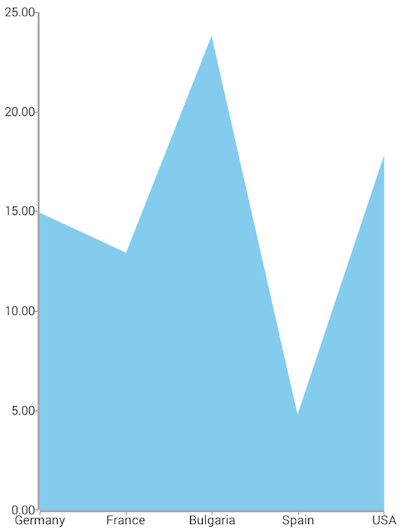

# Chart Area Series

**AreaSeries** are a type of [CategoricalSeries]( "Chart Series Overview") that present categorical data as points connected with a line and then fill the are between the line and the category axis. The are chart usually visualizes a trend in data over intervals of time, but can also be used to show comparisons among discrete categories.

* [Setup](#setup)
* [References](#references)

## Setup

To display an Area Chart, you will need to:
- Add a **RadCartesianChart** to your page.
- Set the chart's **horizontalAxis** to a category axis (**CategoricalAxis**, **DateTimeCategoricalAxis** or **DateTimeContinuousAxis**).
- Set the chart's **verticalAxis** to a value axis (**LinearAxis** or **LogarithmicAxis**).
- Add at least one instance of **AreaSeries**  to the chart's **series** property and set its **items** property to a collection of data items, its **categoryProperty** set to the name of the property of the data items that will be used to determine their category and its **valueProperty** to the name of the property used to determine their value.
 
To illustrate this setup, let's create an example. First we will create a source with items:
 
#### Example 1: Define a source with data

<snippet id='categorical-source'/>

We use an instance of this model to assign it as the `bindingContext` of the page we have put our Area series on:

#### Example 2: Update bindingContext

<snippet id='binding-context-area-series'/>

And finally, in the XML definition of the page we put a `RadCartesianChart`, add a AreaSeries instance to it and bind the series to the source of data:

#### Example 3: Add chart to page's markup

<snippet id='area-series'/>

#### Figure 1: Chart with AreaSeries on Android (left) and iOS (right)

 

## References

Want to see this scenario in action?
Check our SDK examples repo on GitHub. You will find this and many other practical examples with NativeScript UI.

Examples used in this article:

* [Area Series Example](https://github.com/NativeScript/nativescript-ui-samples/tree/master/chart/app/examples/series/area)

Related articles you might find useful:

* [**Spline Area Series**]()
* [**Line Series**]()
* [**Bar Series**]()
