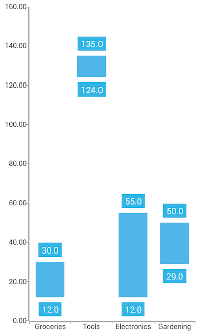
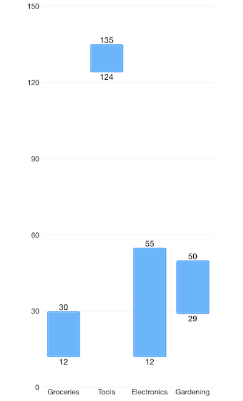

# Chart Range Bar Series

**RangeBarSeries** are a type of [CategoricalSeries]( "Chart Series Overview") that present categorical data with rectangular bars with heights or lengths proportional to the values that they represent. They differ from **BarSeries** by the fact that they represent two values - low and high and each bar represent the difference between a point's low and high value. The range bar chart usually shows comparisons among discrete categories but can also be used to visualize a trend in data over intervals of time.

## Setup

To display a Range Bar Chart, you will need to:
- Add a **RadCartesianChart** to your page.
- Set the chart's **horizontalAxis** to a category axis (**CategoricalAxis**, **DateTimeCategoricalAxis** or **DateTimeContinuousAxis**).
- Set the chart's **verticalAxis** to a value axis (**LinearAxis** or **LogarithmicAxis**).
- Add at least one instance of **RangeBarSeries**  to the chart's **series** property and set its **items** property to a collection of data items, its **categoryProperty** set to the name of the property of the data items that will be used to determine their category and the **lowPropertyName** and **highPropertyName** to the names of the properties used to determine their low and high values.

 > The above setup will create a chart with vertical bars. If you need horizontal bars, you can swap the axes' position and assign the category axis to the *verticalAxis* property and the value axis to the *horizontalAxis* property.
 
To illustrate this setup, let's create an example. First we will create a source with items:
 
#### Example 1: Define a source with data
 
<snippet id='range-bar-source'/>

Note that since the bar chart shows categories, each category must be unique. In the above example, the category is 'Country'. Including the same category more than once would result in some data not being displayed.
We will use an instance of this model to assign it as the `bindingContext` of the page we have put our Range Bar series on:

#### Example 2: Update bindingContext

<snippet id='binding-context-range-bar'/>

And finally, in the XML definition of the page we put a RadCartesianChart, add a RangeBarSeries instance to it and bind the series to the source of data:

#### Example 3: Add chart to page's markup

<snippet id='range-bar-series'/>

#### Figure 1: Chart with RangeBarSeries on Android (left) and iOS (right)

 

## References

Want to see this scenario in action?
Check our SDK examples repo on GitHub. You will find this and many other practical examples with NativeScript UI.

Examples used in this article:

* [Range Bar Series Example](https://github.com/NativeScript/nativescript-ui-samples/tree/master/chart/app/examples/series/bar)

Related articles you might find useful:

* [**Bar Series**]()
* [**Candlestick Series**]()
* [**Ohlc Series**]()
