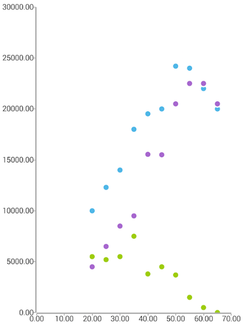
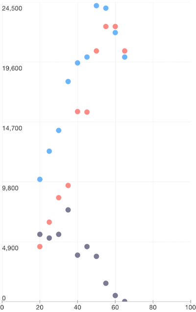

# Chart Scatter Series

**ScatterSeries** are a type of [CartesianSeries]( "Chart Series Overview") that use Cartesian coordinates to display values for typically two variables for a set of data. The data are displayed as a collection of points, each having the value of one variable determining the position on the horizontal axis and the value of the other variable determining the position on the vertical axis.

* [Setup](#setup)
* [References](#references)

## Setup

To display a Scatter Chart, you will need to:
To display a Scatter Bubble Chart, you will need to:
- Add a **RadCartesianChart** to your page.
- Set the chart's **horizontalAxis** to a category axis (**CategoricalAxis**, **DateTimeCategoricalAxis** or **DateTimeContinuousAxis**).
- Set the chart's **verticalAxis** to a value axis (**LinearAxis** or **LogarithmicAxis**).
- Add at least one instance of **ScatterSeries**  to the chart's **series** property and set its **items** property to a collection of data items and the **xProperty** and **yProperty** to the names of the properties used to determine where to plot the scatter points.

To illustrate this setup, let's create an example. First we will create a source with items:
 
#### Example 1: Define a source with data

<snippet id='scatter-data-source'/>

We use an instance of this model to assign it as the `bindingContext` of the page we have put our Scatter series on:

#### Example 2: Update bindingContext

<snippet id='binding-context-scatter'/>

And finally, in the XML definition of the page we put a , add a  instance to it and bind the series to the source of data:

#### Example 3: Add chart to page's markup

<snippet id='scatter-series'/>

#### Figure 1: Chart with ScatterSeries on Android (left) and iOS (right)

 

## References

Want to see this scenario in action?
Check our SDK examples repo on GitHub. You will find this and many other practical examples with NativeScript UI.

Examples used in this article:

* [Scatter Series Example](https://github.com/NativeScript/nativescript-ui-samples/tree/master/chart/app/examples/series/scatter)

Related articles you might find useful:

* [**Area Series**]()
* [**Bubble Series**]()
* [**Scatter Bubble Series**]()
