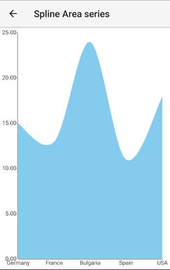
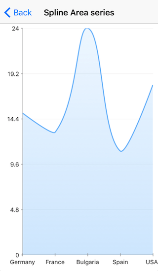

# Chart Spline Area Series

**SplineAreaSeries** are a type of [CategoricalSeries]( "Chart Series Overview") that present categorical data as points connected with a spline, i.e. a curved line segments and then fill the area between the spline and the category axis. The spline area chart usually visualizes a trend in data over intervals of time, but can also be used to show comparisons among discrete categories.

* [Setup](#setup)
* [References](#references)

## Setup

To display a Line Chart, you will need to:
- Add a **RadCartesianChart** to your page.
- Set the chart's **horizontalAxis** to a category axis (**CategoricalAxis**, **DateTimeCategoricalAxis** or **DateTimeContinuousAxis**).
- Set the chart's **verticalAxis** to a value axis (**LinearAxis** or **LogarithmicAxis**).
- Add at least one instance of **SplineAreaSeries**  to the chart's **series** property and set its **items** property to a collection of data items, its **categoryProperty** set to the name of the property of the data items that will be used to determine their category and its **valueProperty** to the name of the property used to determine their value.

To illustrate this setup, let's create an example. First we will create a source with items:
 
#### Example 1: Define a source with data
 
<snippet id='categorical-source-ts'/>

We use an instance of this model to assign it as the `bindingContext` of the page we have put our Spline Area series on:

#### Example 2: Update bindingContext

<snippet id='spline-area-series-binding-context'/>

#### Example 3: Add chart to page's markup

<snippet id='spline-area-series-xml'/>

#### Figure 1: Chart with SplineAreaSeries on Android (left) and iOS (right)

 

## References

Want to see this scenario in action?
Check our SDK examples repo on GitHub. You will find this and many other practical examples with NativeScript UI.

Examples used in this article:

* [Spline Area Series Example](https://github.com/NativeScript/nativescript-ui-samples/tree/master/chart/app/examples/series/area)

Related articles you might find useful:

* [**Area Series**]()
* [**Spline Series**]()
* [**Line Series**]()
