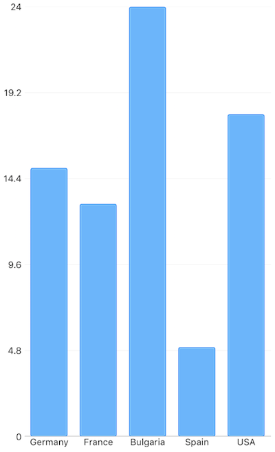

# Chart Getting Started

In this article, you will learn to start using NativeScript UI Chart: how to initialize the chart, how to create the data series and how to use the different axes. The code snippets from this section are available as [a standalone demo application](https://github.com/NativeScript/nativescript-ui-samples).

* [Plugin Installation](#plugin-installation)
* [Data Model](#data-model)
* [Initialization](#initialization)
* [References](#references)

## Plugin Installation

Run the following command to add the plugin to your application:

```
tns plugin add nativescript-ui-chart
```

## Data Model

Let's start with the DataModel that we will use for our Chart instance. We will create a basic Data Model that will contain a collection of objects, which will have two properties that will be used by the chart to provide intuitive data visualization.

#### Example 1: Define a source with data

<snippet id='categorical-source'/>

## Initialization

Now we can create a new page where we will put the Chart instance. First we will need to ensure that the Chart will be able to show any data, so we will create a page loaded event handler that will set the page's binding context.

Then, in order to add a chart instance in a page of the application, you need to define the following XML namespace:

- `xmlns:chart="nativescript-ui-chart"`.

The next step is to add the chart to the page. In this case we will use the **RadCartesianChart** type. For an example with **RadPieChart** you can refer to the PieSeries [article]( "Read more about PieSeries")

> Charts must be put in a parent layout panel that does not require from its children to have their own desired size. You should not therefore put your chart in a `StackLayout` or an auto-sized row within a `GridLayout`.

After adding the chart to the page we need to add the series we will use in order to show the chart. In this case we will use the [BarSeries]( "Read more about BarSeries") in combination with a [Categorical axis]( "Read more about Categorical axis.") and a [Linear axis]( "Read more about Linear axis."). We set the `categoryProperty` of the series to the `Country` property in the objects from our data model and the `valueProperty` to the `Amount` property.
Then we set the `horizontalAxis` to an instance of a `CategoricalAxis` and the `verticalAxis` to an instance of a `LinearAxis`.

#### Example 2: Add chart to page's markup

<snippet id='bar-series'/>

This will produce a page showing a Chart that will look like this:

#### Figure 1: Chart with BarSeries on Android (left) and iOS (right)

 

## References

Want to see this scenario in action?
Check our [SDK Examples](https://github.com/NativeScript/nativescript-ui-samples) repository on GitHub. You will find this and many other practical examples with NativeScript UI.

Examples used in this article:

* [Chart Bar Series Example](https://github.com/NativeScript/nativescript-ui-samples/tree/master/chart/app/examples/series/bar)

Related articles you might find useful:

* [**Bar Series**]()
* [**Line Series**]()
* [**Axes Overview**]()
