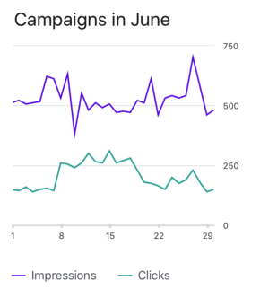

# Chart Overview

The NativeScript UI Chart is a charting component designed for the mobile environment. It offers great performance in loading time, drawing capabilities and real-time updates. Its intuitive object model and public API allow you to easily setup complex chart objects and integrate them into your application. The plugin provides two views that can be placed in a NativeScript layout -  - used to visualize (or plot) data on a cartesian coordinate system and  - used to visualize data in a way that resembles slices of a pie. An intuitive data binding mechanism transforms the raw data to appropriate data points. The plugin is distributed through the **nativescript-ui-chart** package on npmjs.

#### Figure 1: Some of the available chart series - LineSeries (left), DonutSeries (right) 

 

## Getting Started

[This article]( "Chart Getting Started") contains the basic steps to start using the nativescript-ui-chart plugin - how to create a list of items and visualize them with one of the available chart series and appropriate axes.

## Series

The series are one of the main components of the chart and determine how the data will be presented. The chart supports over 10 different series types, some of the most popular being BarSeries, LineSeries and PieSeries. [This article]( "Chart Series Overview") contains an overview of the different types and suggests the most appropriate depending on the data that has to be presented.

## Axes

When using Series that plot the data in Cartesian coordinates, the **RadCartesianChart** has to be used. It also requires two axes that determine what the horizontal and vertical coordinates represent. More information about the available axis types and examples for their usage is available in the [axes article]( "Chart Axes Overview").

## Grid

The RadCartesianChart can draw lines and stripes (the fill between the lines) behind the visualized series to illustrate better how the data relates to the values in the axes. This is controlled by the **RadCartesianChartGrid** which is demonstrated in [this article]( "Chart Grid").

## Annotations

The RadCartesianChart can also show linear and rectangular shapes over its series in order to annotate specific values on the chart. This can be achieved by adding instances of **ChartGridLineAnnotation** and/or **ChartPlotBandAnnotation**. These types are demonstrated in [this article]( "Chart Annotations").

## Trackball

The trackball is another feature availalbe for RadCartesianChart. When it is enabled users are able to display information about a point on the chart by hold and drag gesture. More information is available in [this article]( "Chart Trackball").

## Legend

Both RadCartesianChart and RadPieChart support adding a **RadLegendView** which will contain information about the presented series. In the context of RadCartesianChart, the legend will contain information about the different series, while in the context of RadPieChart it will contain information about the different slices for the presented series. More information is available in [this article]( "Chart Legend").
