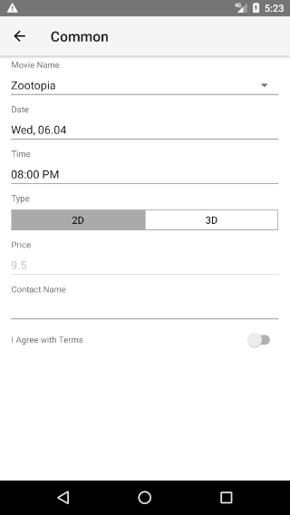
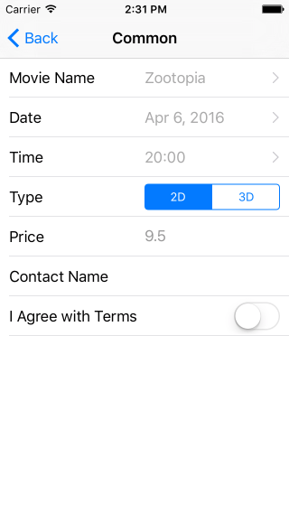

# RadDataForm Editors Overview

If you followed the [getting started]( "RadDataForm getting started") section, you now know how to edit an object's properties with `RadDataForm` for NativeScript. This article will explain how to change the editor that is used for a property, what editors are supported by  and how to use them.

* [Usage](#usage)
* [Converters](#converters)
* [Additional Parameters](#additional-parameters)
* [Editors List](#editors-list)
* [References](#references)

#### Figure 1: Some of the editors supported by RadDataForm on Android (left) and iOS (right)

 

## Usage

By default,  will load a default editor depending on the type of each property of the source object. If you need to change the type, you can provide another editor through xml or code-behind. This is demonstrated in the following examples:

#### Example 1: Change the editor that is used for a property through XML

<snippet id='dataform-editors-xml'/>

#### Example 2: Change the editor that is used for a property through code-behind

<snippet id='dataform-editors-code'/>

Note that the  property will be taken into consideration only for editors that support predefined list of values. These editors are , ,  and . You can read more about the providers [here]( "RadDataForm value providers").

## Converters

In the example in the beginning of the article the  of the `EntityProperty` was set to an array of strings and the value of the property of the source object that was edited was also of type `string`. In some scenarios you will need to save a value which differs from the one that an editor displays. Consider the following example where you have a class `Movie` with two properties - `name` and `id`. If you want to save the value of the `id` and also display the value of the `name` in an editor, you can create a converter that will convert between the two values. Here's a sample implementation of the aforementioned scenario:

#### Example 3: Use a converter to change the type of the editor value before it is saved in the source object

<snippet id='dataform-converters-code'/>

As you can see in your model you can have a property of type `number` which represents the `id` of a movie which gets converted to the `name` of the movie with the same `id`. Similarly, when an item is selected from the list, its `name` is converted to the `id` which is the value that gets committed to the source object. An instance of the created converter has to be set to the  property of the [EntityProperty]( "RadDataForm Describe the Properties") object.

## Additional Parameters

The  and  editors have additional properties which you can be setup through . The following example of the  editor shows how to limit its bounds and define its step:

#### Example 4: Use editor params to adjust an editor

<snippet id='dataform-editor-params-xml'/>

## Editors List

You can find the list with all available editors [here]( "RadDataForm editors list").

## References

Want to see these scenarios in action?
Check our [SDK Examples](https://github.com/NativeScript/nativescript-ui-samples) repo on GitHub. You will find these and many other practical examples with NativeScript UI.

* [Editors Common Example](https://github.com/NativeScript/nativescript-ui-samples/tree/master/dataform/app/examples/editors)
* [Runtime Updates Example](https://github.com/NativeScript/nativescript-ui-samples/tree/master/dataform/app/examples/runtime-updates)

Related articles you might find useful:

* [**Editors List**]()
* [**Value Providers**]()
