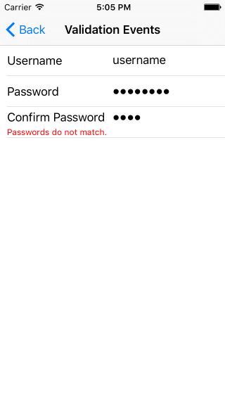
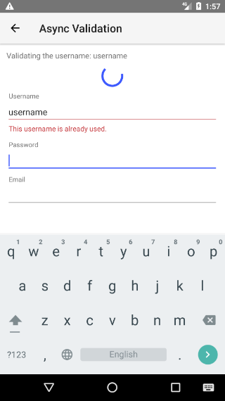
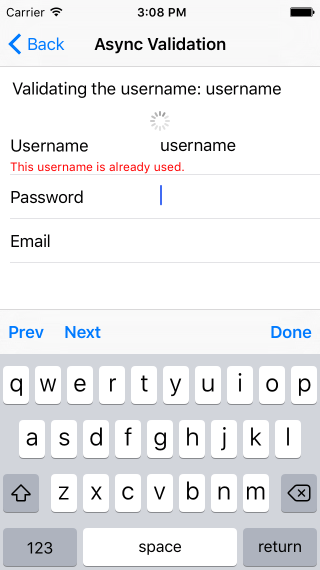

# RadDataForm Validation Events

If you followed the [getting started]( "RadDataForm getting started") section, you now know how to edit an object's properties with `RadDataForm` for NativeScript. From the [validation overview]( "RadDataForm validation overview") you should have become acquainted with the validation feature in . This article will show you how to use the validation events in .

* [Overview](#overview)
* [Validate](#validate)
* [Validated](#validated)
* [References](#references)

## Overview

There are two validation events that you can use to get notified when a property in  gets validated:

* **propertyValidate**: This event is fired while the value is validating and allows you to interfere and change the validation result.
* **propertyValidated**: This event is fired after the validation has finished and you can use it to check the final result from the validation.

## Validate

The **propertyValidate** event gives you an opportunity to change the validation result through  of the method's event args, for example for custom validation. You can also use it for asynchronous validation by setting the validation result to a <a href="https://developer.mozilla.org/en-US/docs/Web/JavaScript/Reference/Global_Objects/Promise" target="_blank">Promise</a> which will be later resolved with the result from the validation.

> Please note that if you are having [validators]( "RadDataForm validators"), for some property the **propertyValidate** event will be fired for this property only if all validators are successful. If you want to be notified for failed validation, use the **propertyValidated** event.

The following example demonstrates how to use the **propertyValidate** event to validate whether two fields contain the same value (for example for confirming passwords or emails).

#### Example 1: Using propertyValidate event for matching fields

<snippet id='dataform-property-validate-event'/>

#### Figure 1: Using `propertyValidate` event to check for matching passwords on Android (left) and iOS (right)

 

This next example shows how to set the validation result to a `Promise` and validate the input asynchronously (for example to check whether a selected username is already used).

#### Example 2: Using propertyValidate event to validate a field asynchronously

<snippet id='dataform-property-validate-async'/>

In this example, we are simulating a slow and (almost) random validation for a property with name `username`. Also our page contains an <a href="https://docs.nativescript.org/cookbook/ui/activity-indicator" target="_blank">ActivityIndicator</a> (named `indicator`) and a <a href="https://docs.nativescript.org/cookbook/ui/label" target="_blank">Label</a> (named `label`) to show information to the user about the current validation state.

#### Figure 2: Using `propertyValidate` event to make async validation of username on Android (left) and iOS (right)

 

## Validated

The **propertyValidated** event gives you an opportunity to get notified that a property is validated and check what is the result from the validation. Here's an example:

#### Example 3: Using propertyValidated event to check the result from validation

<snippet id='dataform-property-validated'/>

## References

Want to see these scenarios in action?
Check our [SDK examples](https://github.com/NativeScript/nativescript-ui-samples) repo on GitHub. You will find these and many other practical examples with NativeScript UI.

* [Validation Events Example](https://github.com/NativeScript/nativescript-ui-samples/tree/master/dataform/app/examples/validation/validation-events)
* [Async Validation Example](https://github.com/NativeScript/nativescript-ui-samples/tree/master/dataform/app/examples/validation/async-validation)

Related articles you might find useful:

* [**Validation Modes**]()
* [**Custom Validation**]()
