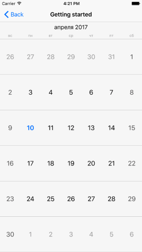

# RadCalendar Localizaiton
 uses the default locale of the operating system it is run on. If you want to explicitly change the locale of the component, you can do so by using the  property. The  property accepts string values representing language tags as per the [BCP-27](https://tools.ietf.org/html/bcp47) standard.

## Defining Locales on RadCalendar
Setting a locale different from the default can be achieved either in XML or programmatically. The following snippet demonstrates how a locale can be set in XML:

<snippet id='angular-calendar-localization-html'/>

The following two screenshots demonstrate how  looks like when a `ru-RU` is defined as a locale:

 

## References
Want to see this scenario in action?
Check our Angular SDK examples repository on GitHub. You will find this and a lot more practical examples with NativeScript UI for Angular:

* [RadCalendar Localization Example](https://github.com/NativeScript/nativescript-ui-samples-angular/tree/master/calendar/app/calendar/calendar-localization)