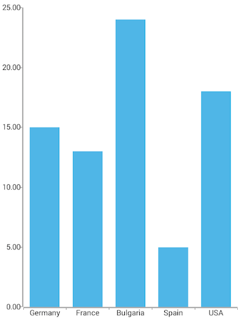

# Chart Bar Series

**BarSeries** are a type of [CategoricalSeries]( "Chart Series Overview") that present categorical data with rectangular bars with heights or lengths proportional to the values that they represent. The bar chart usually shows comparisons among discrete categories but can also be used to visualize a trend in data over intervals of time.

* [Setup](#setup)
* [Bar Size](#bar-size)
* [References](#references)

## Setup

To display a Bar Chart, you will need to:
- Add a **RadCartesianChart** to your component.
- Add a category axis (**CategoricalAxis**, **DateTimeCategoricalAxis** or **DateTimeContinuousAxis**) with the **tkCartesianHorizontalAxis** directive.
- Add a value axis (**LinearAxis** or **LogarithmicAxis**) with the **tkCartesianVerticalAxis** directive.
- Add at least one instance of **BarSeries**  with the **tkCartesianSeries** directive and set its **items** property to a collection of data items, its **categoryProperty** to the name of the property of the data items that will be used to determine their category and its **valueProperty** to the name of the property used to determine their value.
 
 > The above setup will create a chart with vertical bars. If you need horizontal bars, you can swap the axes' position and add the tkCartesianVerticalAxis to the category axis and the tkCartesianHorizontalAxis to the value axis.
 
To illustrate this setup, let's create an example. Just like with all angular 'pages' let's start with the `Component` in which we will place our  instance. We create a basic angular `Component` that contains a collection of objects provided by an custom service, which will be used by the chart to provide intuitive data visualization. The service is a simple 'mock' of an backend call that will return an array of objects:
  
#### Example 1: Define a data service

<snippet id='chart-angular-data-service'/>

Inside that service we have a single function which returns an array:

#### Example 2: Define a source with data

<snippet id='chart-angular-categorical-source'/>

<snippet id='chart-angular-country'/>

#### Example 3: Add chart to component's template

<snippet id='chart-angular-bar-series-component'/>
<snippet id='chart-angular-bar-series'/>

#### Figure 1: Chart with BarSeries on Android (left) and iOS (right)

 

## Bar Size

By default, the size of a bar is calculated based on the axis plot mode and the count of the categories from the data source. There are cases in which the automatically calculated size does not meet the specific application scenarios. By using the  and  properties you can adjust the size of a single bar within the series. The properties accept values in device independent pixels. These properties define boundaries for the size of a bar.

## References

Want to see this scenario in action?
Check our SDK examples repo on GitHub. You will find this and many other practical examples with NativeScript UI.

Examples used in this article:

* [Bar Series Example](https://github.com/NativeScript/nativescript-ui-samples-angular/tree/master/chart/app/examples/series/bar)

Related articles you might find useful:

* [**Bubble Series**]()
* [**Range Bar Series**]()
* [**Line Series**]()
