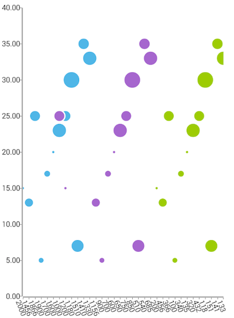
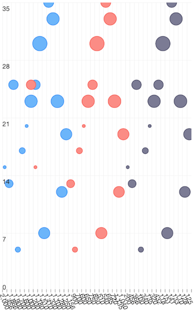

# Chart Bubble Series

**BubbleSeries** are a type of [CategoricalSeries]( "Chart Series Overview") that present categorical data with bubble shapes plot on cartesian coordinates based on the values that they represent. The bubble chart usually shows comparisons among discrete categories but can also be used to visualize a trend in data over intervals of time. They differ from **BarSeries** not only by the shape used, but also that they can visualize a third value (on top of category and value) through the size of the bubbles. If you want to show bubbles for data which is not categorical, you can use [ScatterBubbleSeries]( "Scatter Bubble Series").

* [Setup](#setup)
* [Bubble Scale](#bubble-scale)
* [References](#references)

## Setup

To display a Bubble Chart, you will need to:
- Add a **RadCartesianChart** to your component.
- Add a category axis (**CategoricalAxis**, **DateTimeCategoricalAxis** or **DateTimeContinuousAxis**) with the **tkCartesianHorizontalAxis** directive.
- Add a value axis (**BubbleSeries** or **LogarithmicAxis**) with the **tkCartesianVerticalAxis** directive.
- Add at least one instance of **BubbleSeries**  with the **tkCartesianSeries** directive and set its **items** property to a collection of data items, its **categoryProperty** to the name of the property of the data items that will be used to determine their category, its **valueProperty** to the name of the property used to determine their value and its **bubbleSizeProperty** to the name of the property used to determine the size of the bubble.

To illustrate this setup, let's create an example. Just like with all angular 'pages' let's start with the `Component` in which we will place our  instance. We create a basic angular `Component` that contains a collection of objects provided by an custom service, which will be used by the chart to provide intuitive data visualization. The service is a simple 'mock' of an backend call that will return an array of objects:

 #### Example 1: Define a data service
 
<snippet id='chart-angular-data-service'/>

Inside that service we have a single function which returns an array:

#### Example 2: Define a source with data

<snippet id='chart-angular-bubble-data-source'/>

<snippet id='chart-angular-country'/>

All that is left is to declare the template of the angular component in which we:

#### Example 3: Add chart to component's template

<snippet id='chart-angular-bubble-series-component'/>
<snippet id='chart-angular-bubble-series'/>

#### Figure 1: Chart with BubbleSeries on Android (left) and iOS (right)

 

## Bubble Scale

Additionally,  expose a  property which can be used to fine-tune the size of the bubbles according to specific application requirements. The way the  property works is by multiplying its value to the radius calculated for each data-point's bubble to determine the bubble's final size.

## References

Want to see this scenario in action?
Check our SDK examples repo on GitHub. You will find this and many other practical examples with NativeScript UI.

Examples used in this article:

* [Bubble Series Example](https://github.com/NativeScript/nativescript-ui-samples-angular/tree/master/chart/app/examples/series/bubble)

Related articles you might find useful:

* [**Bar Series**]()
* [**Line Series**]()
* [**Scatter Bubble Series**]()
