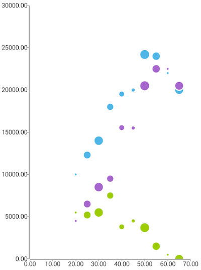
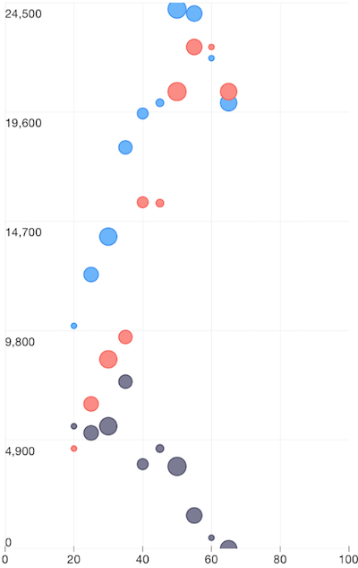

# Chart Scatter Bubble Series

**ScatterBubbleSeries** are a type of [CartesianSeries]( "Chart Series Overview") that use Cartesian coordinates to display values for typically two variables for a set of data. The data are displayed as a collection of bubble, each having the value of one variable determining the position on the horizontal axis and the value of the other variable determining the position on the vertical axis. Unlike **ScatterSeries** they can visualize a third value (on top of the two value properties) through the size of the bubbles. If you want to show bubbles for categorical data, you can use [BubbleSeries]( "Bubble Series").

* [Setup](#setup)
* [Bubble Scale](#bubble-scale)
* [References](#references)

## Setup

To display a Scatter Bubble Chart, you will need to:
- Add a **RadCartesianChart** to your component.
- Add a category axis (**CategoricalAxis**, **DateTimeCategoricalAxis** or **DateTimeContinuousAxis**) with the **tkCartesianHorizontalAxis** directive.
- Add a value axis (**LinearAxis** or **LogarithmicAxis**) with the **tkCartesianVerticalAxis** directive.
- Add at least one instance of **ScatterSeries** with the **tkCartesianSeries** directive and set its **items** property to a collection of data items, the **xProperty** and **yProperty** to the names of the properties used to determine where to plot the scatter points and the **bubbleSizeProperty** to the name of the property used to determine the size of the bubble.

To illustrate this setup, let's create an example. Just like with all angular 'pages' let's start with the `Component` in which we will place our  instance. We create a basic angular `Component` that contains a collection of objects provided by an custom service, which will be used by the chart to provide intuitive data visualization. The service is a simple 'mock' of an backend call that will return an array of objects:
 
 #### Example 1: Define a data service

<snippet id='chart-angular-data-service'/>

Inside that service we have a single function which returns an array:

#### Example 2: Define a source with data

<snippet id='chart-angular-scatter-data-source'/>

<snippet id='chart-angular-person'/>

#### Example 3: Add chart to component's template

<snippet id='chart-angular-scatter-bubble-series-component'/>
<snippet id='chart-angular-scatter-bubble-series'/>

#### Figure 1: Chart with ScatterBubbleSeries on Android (left) and iOS (right)

 

## Bubble Scale

Additionally,  expose a  property which can be used to fine-tune the size of the bubbles according to specific application requirements. The way the  property works is by multiplying its value to the radius calculated for each data-point's bubble to determine the bubble's final size.

## References

Want to see this scenario in action?
Check our SDK examples repo on GitHub. You will find this and many other practical examples with NativeScript UI.

Examples used in this article:

* [Scatter Bubble Series Example](https://github.com/NativeScript/nativescript-ui-samples-angular/tree/master/chart/app/examples/series/bubble)

Related articles you might find useful:

* [**Bubble Series**]()
* [**Range Bar Series**]()
* [**Scatter Series**]()
