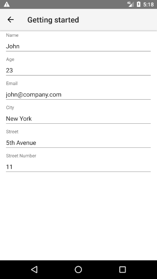
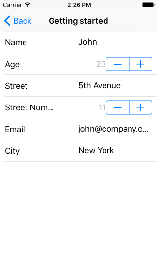

# RadDataForm Getting Started
In this article, you will learn to get started with the DataForm plugin for NativeScript: how to initialize the dataform.

## Installation
Run the following command to add the plugin to your application:

```
tns plugin add nativescript-ui-dataform
```

## Adding a RadDataForm to Your Component's template
Before proceeding, make sure that the  from the *nativescript-ui-dataform* plugin has been imported in an `ngModule` in your app. For example:

```TypeScript
import { NativeScriptUIDataFormModule } from "nativescript-ui-dataform/angular";
@NgModule({
    schemas: [NO_ERRORS_SCHEMA],
    imports: [
        ....
        NativeScriptUIDataFormModule,
        ....
    ],
    declarations: [
        ....
    ]
})
export class DataFormExamplesModule { }
```

[Demo](https://github.com/NativeScript/nativescript-ui-samples-angular/blob/master/dataform/app/examples/dataform-examples.module.ts).

Let's start with the `Component` in which we will place our RadDataForm instance.

<snippet id='angular-dataform-getting-started-html'/>
<snippet id='angular-dataform-getting-started-context'/>

[Demo](https://github.com/NativeScript/nativescript-ui-samples-angular/tree/d98b5371644d1e34fa5506886dd0ea48b5d35ddb/dataform/app/examples/getting-started)


 
