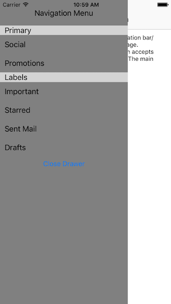
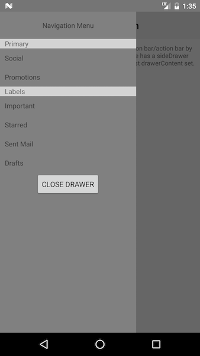

> With the **4.x.x** release of the **nativescript-ui-sidedrawer** plugin the  no longer has a dedicated `showOverNavigation` property. More details can be found below in the "Migrating from versions 3.x.x to the latest version" section.

# Share a Single RadSideDrawer throughout the Entire Life Cycle of the Application

By popular desire we have revisited the way the  is, was and wanted to be used by the community. While there are a few cases where the current design API-wise was performing as desired we heard overwhelmingly from the community that the  is a fundamental element in most mobile applications and should be easily shown everywhere inside of it. In the 3.x.x versions in order to show the element on each new page you would have to duplicate it in each HTML declaration leading to less than perfect experience and making maintenance quite redundant. Having this in mind we revisited the API of the  and implemented it in a way that the above "shared" use case is possible while not changing its API too much to avoid major breaking changes. 

With the **4.x.x** version of the plugin it is possible to use the  as **the root element** of your application. This way it will be persisted and "shared" throughout the entire life cycle of the application. In order to use the element as a root simply:

- Declare it as the single first element in your bootstrapped component
- Set the `tkDrawerContent` as usual
- Set the `tkMainContent` to a `page-router-outlet` instance

For example:

```
<RadSideDrawer>
    <GridLayout tkDrawerContent>
        <Label text="Side Menu"></Label>
    </GridLayout>

    <page-router-outlet tkMainContent></page-router-outlet>
</RadSideDrawer>
```

[Demo Source](https://github.com/NativeScript/nativescript-ui-samples-angular/blob/master/sidedrawer/app/navigation/app.component.html)

By design when navigation is executed in the NativeScript application that navigation will be executed inside the `page-router-outlet` instance which means that the  instance will be persisted during that navigation.

When using the  as a root element it will by design **always be shown over the navigation bar**. 

#### Figure 1. RadSideDrawer as a root element and over navigation bar (ActionBar)
  

## Migrating from versions 3.x.x to the latest version

With the latest 4.x.x and above versions the  element has had a few changes to its API and usage. There have been two major changes:
- The `showOverNavigation` property has been removed and replaced by a change in the way the element is utilized. More details can be found below in the "Showing the RadSideDrawer over the navigation bar" section. 
- The  can be "shared" throughout the entire life cycle of the application

### Showing the RadSideDrawer over the navigation bar 

With the latest versions in showing  element above or below the navigation bar has been re-designed and is no longer controlled by a property but rather by the way the element is utilized in the application. While hearing a lot of feedback from the community we noticed that the majority of it was changing the `showOverNavigation` property from its default value of `false` to `true` and also was duplicating the element on each Angular component. This is why we have introduced improvements in both cases by allowing the element to be persisted throughout the entire life cycle of the application which also by design will shown over the navigation bar. It is no longer necessary to set any property, simply set the  as a root of your application. More details can be found above in the "Share a single RadSideDrawer throughout the entire life cycle of the application" section

### How to migrate from duplicated RadSideDrawer to a single root element
If you were using the  element in 3.x.x you may have ended with duplicating its declaration in each Angular component you have in your app. With 4.x.x this is no longer needed but it is backward compatible and should work as expected. You can now truly "share" one declaration in the entire application which is also the recommended approach performance wise. Simply follow this common steps for migrating from 3.x.x to 4.x.x:
- Remove the duplicated `RadSideDrawer` declarations from your HTML
- In the HTML of the bootstrapped component, add the  as a single first element:

```
<RadSideDrawer>
    ...
</RadSideDrawer>
```

- Set the `tkMainContent` to a `page-router-outlet` instance:

```
<page-router-outlet tkMainContent></page-router-outlet>
```

If you find yourself in the need to access the  from one of your Pages you can use the `Application.getRootView()` function:

```
import { Application } from "@nativescript/core";
import { RadSideDrawer } from "nativescript-ui-sidedrawer";

let sideDrawer = <RadSideDrawer>Application.getRootView();
```